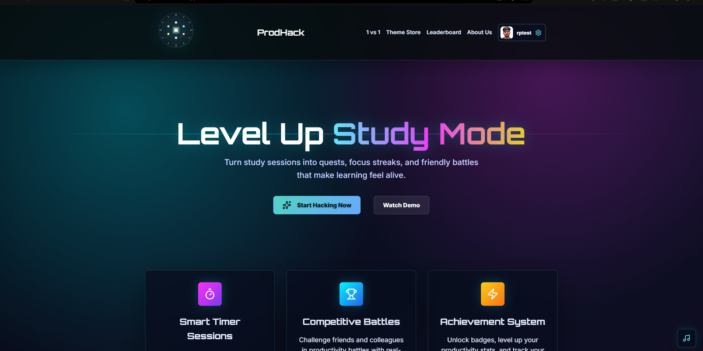
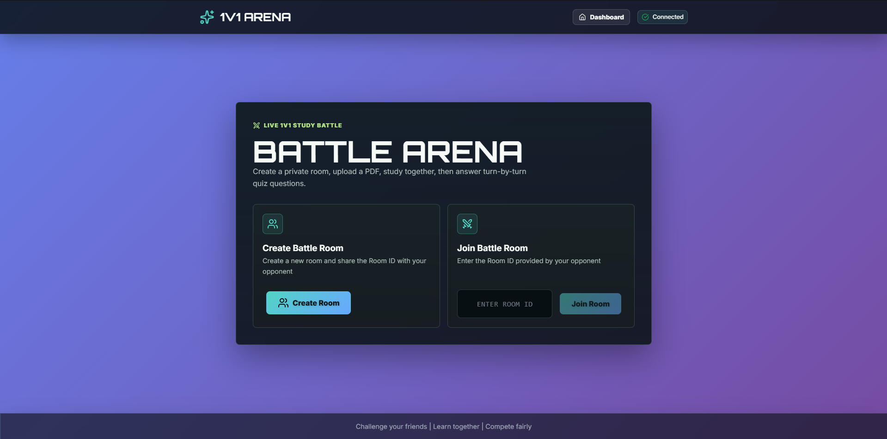
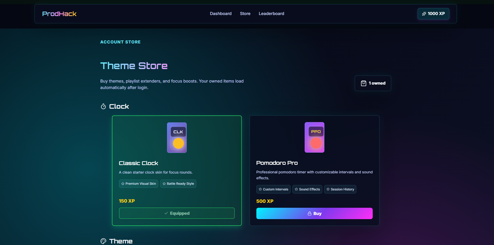
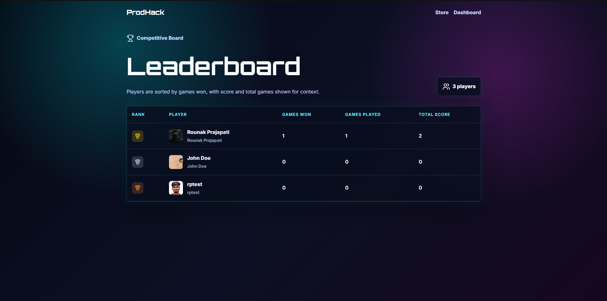

# ProdHack

ProdHack is a productivity battle and study companion app. It includes user authentication, a dashboard, a 1v1 real-time battle mode, a theme store, leaderboards, and AI-powered PDF quiz generation.

## Screenshots

Add screenshots or demo GIFs here after deployment.

### Home / Dashboard



### 1v1 Battle



### Theme Store



### Leaderboard



## Project Structure

```txt
ProdHack/
|-- backend/              # Express API, Socket.IO server, MongoDB models
|   |-- models/
|   |-- routes/
|   |-- .env.example
|   |-- package.json
|   `-- server.js
|-- frontend/             # Vite + React app for Vercel
|   |-- public/
|   |-- src/
|   |   |-- assets/
|   |   |-- config/
|   |   `-- *.jsx / *.css
|   |-- .env.example
|   |-- package.json
|   |-- vercel.json
|   `-- vite.config.js
`-- README.md
```

## Tech Stack

- Frontend: React, Vite, React Router, Lucide React, Socket.IO Client
- Backend: Node.js, Express, Socket.IO, MongoDB, Mongoose
- Auth: JWT, bcrypt
- AI: Google Gemini API
- Deployment: Vercel for frontend, Render for backend

## Features

- User signup and login
- Profile dashboard
- Real-time 1v1 productivity battle rooms
- PDF upload and AI quiz generation
- Store items, wallet, theme equip flow, and playlist slots
- Leaderboard based on player progress
- CORS-ready deployment config for Vercel + Render

## Environment Variables

Never commit real `.env` files. Use the `.env.example` files as templates.

### Backend

Create `backend/.env` locally:

```txt
MONGODB_URI=your_mongodb_connection_string
JWT_SECRET=your_long_random_secret
GEMINI_API_KEY=your_gemini_api_key
CLIENT_ORIGIN=http://localhost:5173
PORT=3000
```

For Render production, set:

```txt
MONGODB_URI=your_mongodb_connection_string
JWT_SECRET=your_long_random_secret
GEMINI_API_KEY=your_gemini_api_key
CLIENT_ORIGIN=https://your-vercel-app.vercel.app,https://*.vercel.app
PORT=3000
```

### Frontend

Create `frontend/.env` locally if you want to override the default local backend:

```txt
VITE_API_URL=http://localhost:3000
```

For Vercel production, set:

```txt
VITE_API_URL=https://your-render-backend.onrender.com
```

Do not add `/api` to `VITE_API_URL`; the frontend adds `/api` internally.

## Local Development

Install backend dependencies:

```bash
cd backend
npm install
npm run dev
```

Install frontend dependencies in another terminal:

```bash
cd frontend
npm install
npm run dev
```

Default local URLs:

- Frontend: `http://localhost:5173`
- Backend: `http://localhost:3000`
- Health check: `http://localhost:3000/api/health`

## Deployment

### Backend on Render

1. Create a new Render Web Service.
2. Set the root directory to `backend`.
3. Use:

```txt
Build Command: npm install
Start Command: node server.js
```

4. Add the backend environment variables listed above.
5. Deploy and copy the Render backend URL.

### Frontend on Vercel

1. Import the GitHub repository into Vercel.
2. Set:

```txt
Root Directory: frontend
Build Command: npm run build
Output Directory: dist
```

3. Add:

```txt
VITE_API_URL=https://your-render-backend.onrender.com
```

4. Deploy.
5. Add the final Vercel URL to Render as `CLIENT_ORIGIN`, then redeploy the backend.

## API Overview

Auth:

- `POST /api/auth/signup`
- `POST /api/auth/login`
- `GET /api/auth/profile`
- `PUT /api/auth/profile`

Store:

- `GET /api/store/items`
- `GET /api/store/me`
- `POST /api/store/purchase`
- `POST /api/store/equip`
- `POST /api/store/playlist`

Battle and leaderboard:

- `GET /api/leaderboard`
- `POST /api/battle/reward`

AI:

- `POST /api/analyze-pdf`

Utility:

- `GET /api/health`

## Git Notes

Ignored by git:

- `node_modules/`
- build folders like `dist/`
- Vite cache folders like `.vite/`
- logs
- `.env` files

Tracked safely:

- `.env.example` files
- source code
- package lock files
- deployment config files

## Current Status

- Frontend is structured for Vercel deployment.
- Backend is structured for Render deployment.
- Frontend API calls use `VITE_API_URL`.
- Backend CORS uses `CLIENT_ORIGIN` and supports Vercel preview URLs.
- Real secrets should stay only in local `.env` files or hosting dashboards.
